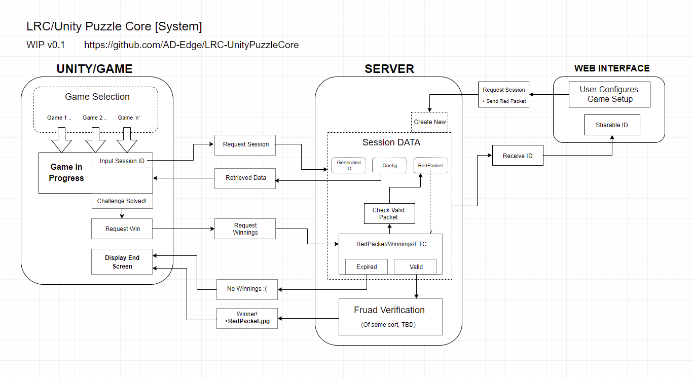
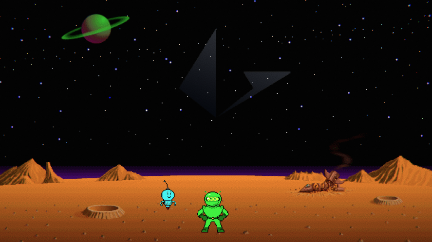
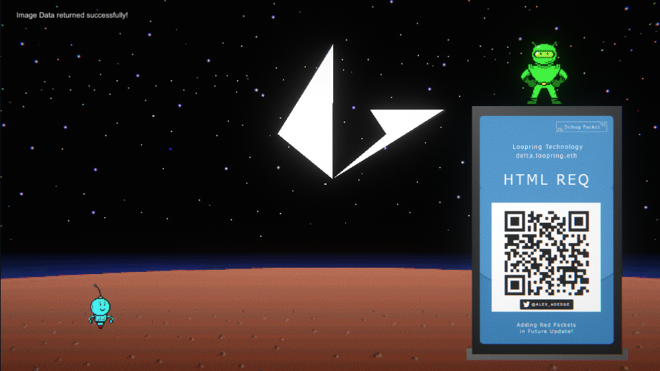

# LRC-UnityPuzzleCore [LRC-UPC]
A WIP Project for Unity GameDev, for the Loopring/Puzzle Gang community. 
Developing a foundation for those who want to build puzzle-based mini-games in Unity, where [RedPackets/LRC/etc] are the prize!

## Plan/Overview
Current system schematic/overview:

## Applications
Current front-end (very WIP!) mini-game based on MathBlaster. This is a starting point to demo this system.

'Loopblaster' Playable mini-game is here on itch.io: 
**https://alex-adedge.itch.io/loopblaster-mathblaster**

##Updates: 

 

[13/03/2022] Frontend test scene with initial image retrieval found in /FrontEndDemo_Unity:

Soon this will allow users (via a interface I havent made yet) to create their own game sessions and upload redpackets to be won.

 

[12/03/2022] Created Repo, uploaded v0.2 Loopblaster to itch.io, sharing progress of LRC-UPC here.

 

By Alex Delderfield 2022
